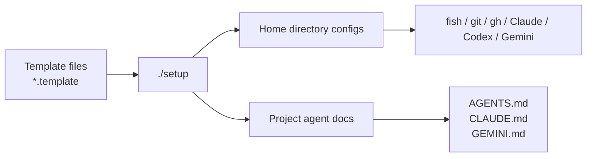
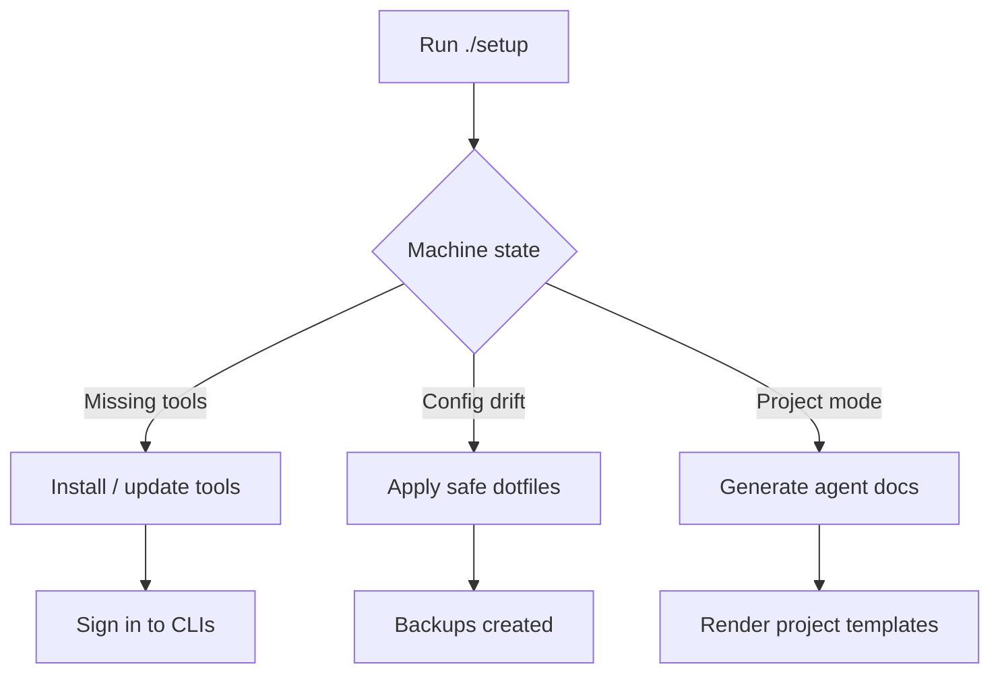

# dotfiles

Config templates and helper tools for bootstrapping a machine and scaffolding AI agent docs.
One repo manages Claude Code, Codex, Gemini, Copilot, shell, git, gh, fonts, and project agent docs.
Status: **0.1.x beta**. The repo is intended for repeatable personal and team use.

## Quick Start

```bash
git clone https://github.com/kairin/000-dotfiles.git ~/000-dotfiles
cd ~/000-dotfiles
./setup
```

Fresh machine: choose option 1, confirm the tool install preview, then choose option 2 after the menu refreshes.
Existing machine: rerun `./setup` and pick the recommended option shown in the menu.
Project docs: run `./setup init --yes --project ~/Apps/my-project`.
Read the deeper guides in `docs/` when you need command details or setup architecture.

## Mental Model





## Docs Map

| Doc | Purpose |
|---|---|
| [docs/README.md](docs/README.md) | Docs hub and table of contents |
| [docs/getting-started.md](docs/getting-started.md) | First-time setup and ongoing maintenance |
| [docs/setup-reference.md](docs/setup-reference.md) | `./setup` menu, wrapper commands, and direct CLI reference |
| [docs/repo-layout.md](docs/repo-layout.md) | Repository structure and template conventions |
| [docs/protected-files.md](docs/protected-files.md) | Files that are reported but never auto-overwritten |
| [docs/validation.md](docs/validation.md) | Tests, coverage, and CI/Codacy flow |
| [docs/troubleshooting.md](docs/troubleshooting.md) | Common issues and fixes |
| [docs/architecture/setup-flow.md](docs/architecture/setup-flow.md) | Interactive setup recommendation flow |
| [docs/architecture/scaffold-flow.md](docs/architecture/scaffold-flow.md) | Project agent-doc scaffolding flow |
| [docs/codacy-coverage-rollout.md](docs/codacy-coverage-rollout.md) | Codacy coverage rollout notes |
| [CHANGELOG.md](CHANGELOG.md) | Version history |

For implementation details, use the docs above instead of the root page.
