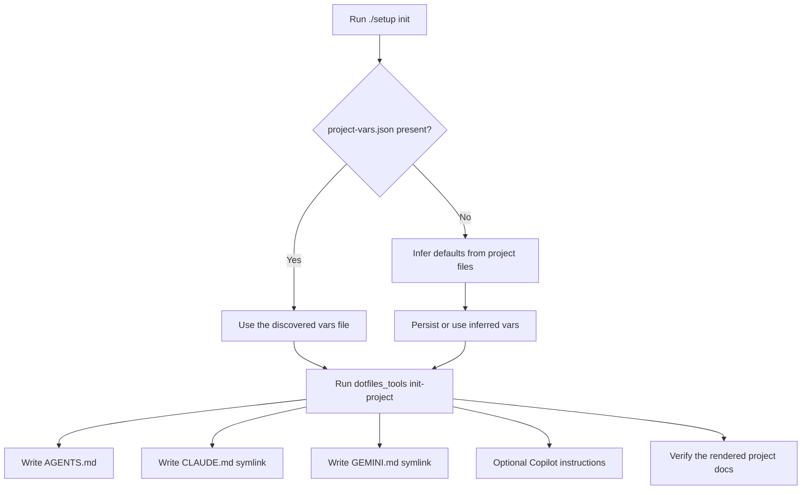

# Scaffold Flow

`./setup init` renders project agent docs from a project metadata file and then verifies the result.

## Flow

## What Gets Generated

- `AGENTS.md` for shared project guidance
- `CLAUDE.md` and `GEMINI.md` as symlinks to `AGENTS.md`
- optional Copilot instructions when requested

## Default Inference

When no vars file is supplied, the wrapper infers defaults from common project files such as `package.json`, `pyproject.toml`, `Cargo.toml`, `go.mod`, and `Makefile`.
