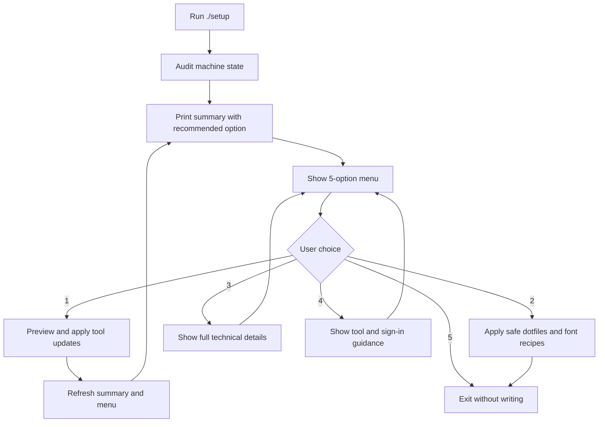

# Setup Flow

`./setup` inspects the machine, prints a recommendation-aware summary, and then shows the stable 5-option menu.
The recommended option changes with the audited state, but the option numbers stay fixed so the menu remains learnable.

## Core Flow

## Recommendation States

- `1` - missing or unverified developer tools
- `2` - safe non-protected dotfiles or font work is pending
- `3` - audit failure, blockers, or manual-only work needs inspection
- `4` - tool and sign-in guidance is the useful next step
- `5` - the machine is already current

## Why The Refresh Matters

Option 1 can change the machine state before the user returns to the menu.
The wrapper refreshes the summary after cancel or completion so the recommended option does not stay stale.
